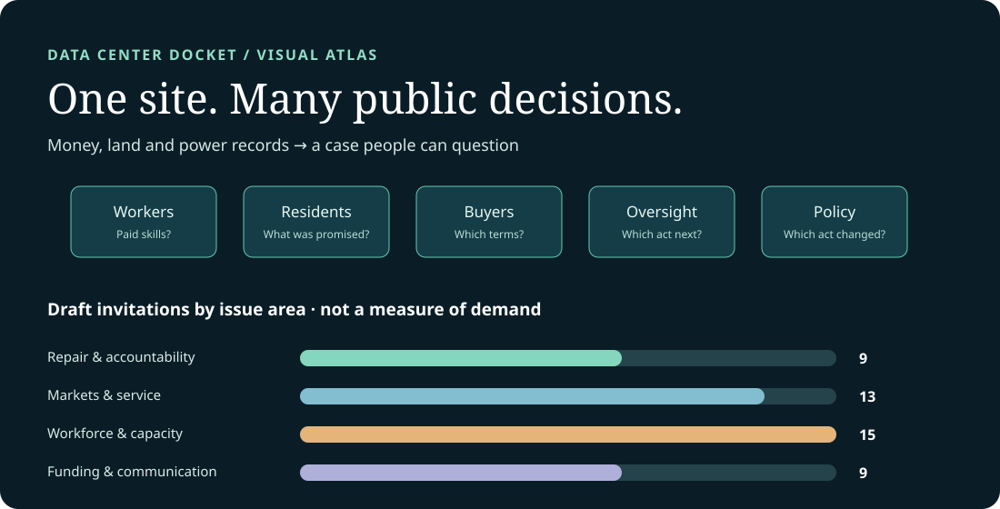
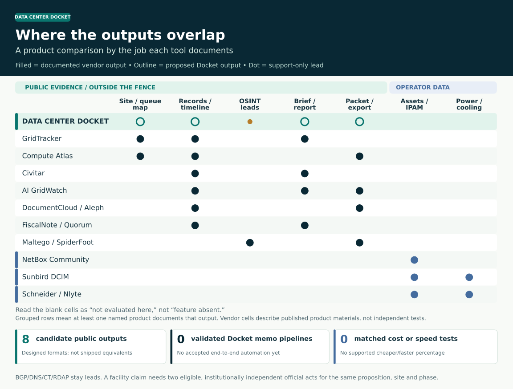

# Data Center Docket: who could build and use it

Start with the [visual product comparison](./comparison.md) or [interactive audience atlas](https://dannybuk-byte.github.io/DCIM/). Then use the invitations below to choose one real question, one possible collaborator and one test.

## Product comparison at a glance

[Read the product sources and cost test](./comparison.md) · [Explore the 61-family public signal atlas](./public-signal-atlas.md).

**Follow an issue:** [Buildout detection, Computational Antitrust, CAP, municipal procurement, insurance and the coalition bridges](./issue-bridges.md).

**Daniel Buk · 29 September 2026**

A proposed data center may first appear in a tax agreement, an environmental notice and a power filing. Those records can describe different phases of the same place. I’m building Data Center Docket to put the originals and their revisions together, show where they agree or conflict, and make the next question easier to ask. This is my personal research and software project, informed by my work on worker-centered infrastructure governance; it is not an authorized product of What We Will or a prospective partner.

The proposed public workflow starts with **money, permission and power**: IDA/PILOT, DEC ENB/SEQR, municipal and relevant PSC/DPS, NYISO or utility acts. Retired-plant, permit, parcel and imagery records add context. Public BGP/RIPE RIS, DNS, certificate transparency, RDAP/ASN and peering observations can help find a lead; they cannot establish a tenant, private traffic or a facility. To confirm one precise facility proposition, the case needs **two eligible, institutionally independent official acts for the same site and phase**. Copies and press echoes do not count twice. A human reviewer can dispute or withhold the claim. The adapters are not all wired; there is no established live statewide detector or measured lead time.

A reviewed public case can show whether a promised community benefit became binding and delivered, or which employer was named for training. A buyer testing supplier exit begins with its own tender, contract and authorized receiving-side task. Each has a different decision maker and evidence boundary. A separate, permissioned Traffic and Workload Stewardship Console is an intended product for authorized service and recovery tests. Public records grant no access to private systems; existing prototypes do not amount to a deployable combined product.

**A useful first test:** Bring one public case, the decision it affects and a plausible contrary explanation. Build one source adapter and a site/phase/claim record a second reviewer can challenge. Compare it with current practice, including missed records, false matches, staff time and correction effort. Agree on rights, paid participation where appropriate, budget and maintenance before a pilot.

The 46 invitations below are possible conversations, **not 46 MVP commitments or established partnerships**. Named organizations are audiences, not endorsers. Keep protected worker, customer and operational records out of a public issue; arrange a separate authorized test when a question needs them.

## The common source-to-decision method

| Stage | Proposed output | Claim boundary |
|---|---|---|
| Find | Original acts, dates, revisions and a separate queue of OSINT leads | A clue or requested MW is not an approved facility or built capacity. |
| Match | Company, site, building and phase; SAME/DISTINCT/UNRESOLVED origins | One institution's repeated act cannot count twice. |
| Check | The exact claim, conflicts, human decision, correction and next document | A public facility confirmation needs two eligible independent official acts for that site, phase and proposition. |
| Explain | A source card, timeline, map and audience-specific memo or export | A map or coalition narrative adds no evidence. |

The [issue pitches](./issue-bridges.md) follow detection into competition, CAP, DPI procurement, insurance and other decisions. The entries below are ways to start a conversation and test a piece of the build.

## Repair, labor, and accountable commitments

### 01. Interoperability critics and repair communicators — usable exit after interoperability promises

The exit test comes after the files move: can the next qualified team repair this service on its actual version? The technician tests the function; workers define paid authority; the buyer decides acceptance. Compare a case where integrated support performs better. An export alone proves no usable exit.

**First test:** Give a repair practitioner one authorized receiving-side task. Record the missing history, credential or right, and invite an opt-in critique of the result.

### 02. EFF interoperability and repair audiences

A device may speak an open interface while the credential needed to fix it remains unavailable. Which exact task is blocked? Technical reviewers test function, workers paid authority and buyers the contract. Qualified counsel or specialists must assess repair-law scope and security exceptions; Docket makes no legal finding.

**First test:** With permission, test one device and firmware against a rights-and-dependency record and a privacy-controlled function trial. Ask before any specialist referral.

### 03. Unions and worker centers

Members should choose the task first: the repair they cannot safely perform or the AI decision they cannot contest. Repairers may test tools and apprenticeship sponsors the skill path. Check whether added visibility could enable deskilling or outsourcing. Workers speak for themselves.

**First test:** Pay members to test one protected workflow. Ask what access, training time, wages and appeal rights would change the task; let them set disclosure rules.

### 04. Labor, subsidy, and corporate-accountability researchers

A project changes hands. Does its training or community promise travel with it, and which signed document says so? Residents name the promise, workers the employer and oversight staff the missing act. Corporate affiliation alone does not transfer a duty.

**First test:** Trace one agreement through amendments, phases and entity changes. Compare mistaken matches, correction time and analyst effort with current review.

### 05. Residents, host communities, and ratepayers

When a developer promises jobs, an upgrade or rate protection, residents need to know what became binding and what arrived. Utility researchers examine bills, workers examine jobs and libraries examine whether a promised asset became a maintained service. An announcement is not delivery.

**First test:** Pay a community reviewer to test one source card and correction path; let that group decide what can be disclosed and what action follows.

### 06. Legislators, public agencies, and oversight offices

A legislator deciding whether to intervene needs the stage in plain view: inquiry, queue request, permit, agreement or delivery. Residents and public buyers can say whether the missing act changes their decision. Requested megawatts and a press announcement are not built capacity.

**First test:** Bring one oversight question. Draft a memo that links original acts, independent origins, conflicts and the next record staff should request.

### 07. Municipal and public-service purchasers — DPI procurement and usable exit

A city can receive every contracted file and still be unable to run its service with another supplier. Repairers test access; workers test paid skill and safety; the public buyer decides acceptance. Compare incumbent support fairly. An export or passing profile alone does not settle the exit.

**First test:** Choose one procurement. Follow tender, award, amendment and implementation into an authorized handoff task, exception and proposed remedy term.

### 08. Pension and labor-capital institutions

An investment gives workers an economic stake. Which written right lets the fund or its agent act on a worker-chosen obligation? Workers define the obligation and contract reviewers locate the decision right. Financial exposure by itself grants neither control nor benefit.

**First test:** Follow one instrument from fund to manager, vehicle, operator and contractor. Compare its evidence and remedy rights with current diligence; protect member input separately.

### 09. Labor-capital scholars

Labor capital matters when a documented investment right changes a worker-defined task or service outcome. Tie the finding to an actual maintenance task and buyer term. Scholarship alone confers no representation, mandate, funding or endorsement.

**First test:** Ask scholars to challenge one instrument-to-rights chain, including a case where integrated support better serves workers.

### 10. Infrastructure investors, lenders, and diligence advisers

A lender may have a recovery clause while the financed service has no workable replacement path. Operators and buyers test service reality; workers test the labor premise. A filing alone proves neither a fault nor impaired collateral.

**First test:** Take one public clause, name the asset and assumption, then list the permitted technical check, missing evidence and downside comparator.

### 11. Privacy-oriented assurance interlocutors

Before anyone calls traffic wasteful, decide whose service improves and who can overturn a wrong judgment. Users, service teams and risk reviewers test different consequences of the same event. A personal exchange grants no insurance sponsorship or customer-data access.

**First test:** Invite an opt-in critique of one minimal event record, its privacy boundary and a falsifiable error question. A later risk study needs a separately consenting qualified party.

### 12. Insurance and risk engineering — defined recovery exposures

In a service outage, who was waiting on detection, permission, diagnosis, repair and restoration? Which delay belongs to the defined loss? Workers define safe paid authority, buyers continuity and risk engineers the loss. Overlapping stages and shifted harm matter. A faster repair does not establish coverage or lower insured loss.

**First test:** With a consenting operator, define one fault drill, incident-stage record and comparator before testing the permissioned console.

### 13. Independent assurance — reconstructable claims and exceptions

An assurance claim should survive a second reviewer who did not write the first summary. Buyers, repairers and residents may ask different questions of the trace. A reviewable package is not certification or a legal opinion.

**First test:** Give that reviewer a blinded export with the original version, contrary evidence, exceptions, corrections and decision authority.

### 14. Silicon Data, benchmark, and compute-market infrastructure audiences

A GPU price reference can move while the contracted service fails for another reason. Which dependency matters in this deal? Buyers, operators and risk reviewers examine separate exposures. Docket has no feed right, price forecast, exchange status or guarantee that a hedge restores compute.

**First test:** With rights-holder and customer permission, map one licensed benchmark version to its adopting clause, fallback, actual capacity and usable service.

### 15. Computational Antitrust — procurement and intermediary controls

A public buyer sees the same intermediary in several bids. Can it still switch suppliers and keep the service working? Buyers test substitution and repairers test the replacement. A shared supplier or similar bids alone establish neither collusion nor liability.

**First test:** Build one public procurement case and a competing cost, quality or service explanation. Keep bidder-sensitive material in a separately authorized study.

### 16. Data-center operators, developers, and service teams

The operator knows its recovery fault; the community knows its public promise. Each needs an evidence path with its own permissions. Keep private incident records under operator control and public commitments on their own source trail. Accept a negative result; one case need not join the two record sets.

**First test:** With a willing sponsor and budget, scope one paid fault drill with qualified workers and independent risk review. Set data and publication terms before access.

### 17. Cloudflare and edge-service audiences

A gateway event can be a useful cancellation or a legitimate retry. The customer's task decides which. Users, service teams and rights reviewers judge benefit and error together. Metadata cannot read intent or justify a universal slop label.

**First test:** With an opt-in customer, test a minimal task ID, gateway metadata, false-block appeal and quality versus resource comparison.

### 18. Hugging Face and model-supply-chain collaborators

A receiving team needs to know which model artifact arrived, under which card and license, and what the scan actually checked. Maintainers check the artifact trail; buyers check the service. No badge means unknown; it does not mean safe or compromised.

**First test:** Test an opt-in provenance adapter on one permitted deployment, with pinned revision, exception and correction history.

### 19. Cloud and managed-service providers

A customer may authorize an export and discover that the receiving team still cannot operate the named function. The buyer accepts the service; repairers and workers test capability. Portability, reserved capacity, price hedging and incident recovery require separate findings.

**First test:** Run one consented sandbox handoff. Agree first on success, exception, security term and cost, then try the task from the receiving side.

### 20a. Open Compute Project technical workstreams

A management profile may pass at the desk and fail at the bench on the actual firmware. Repairers test access and workers test paid authority. Conformance, recognition, safety review and legal repair rights remain distinct.

**First test:** Select one profile, device, role and lawful task. Let a qualified technician run the function and let the buyer review the exception.

### 20b. Right-to-repair communities and advocates

Start with the blocked repair: the product, version, task and stated security reason. Standards reviewers examine function; workers and buyers examine skill and acceptance. Contract, statute and safety may limit the route.

**First test:** Run one authorized task trial, keep the access record and test whether a narrower lawful route would resolve the block.

### 21. Uptime, iMasons, AFCOM, and infrastructure professional networks

Two outage reports cannot be compared if one clock starts at detection and the other at repair. Risk engineers, operators and workers can examine compatible intervals. This grants no network-wide participation, certification or access to private incidents; overlapping downtime is not additive.

**First test:** Ask a willing subgroup to challenge stage definitions, qualifications and a de-identified fixture for the permissioned console.

### 22a. Techsgiving — delivery pathway

Training should lead from a named infrastructure task to supervised practice and paid work. Workers judge job quality; colleges and employers test entry. An earlier proposal is no Docket award, contract or placement.

**First test:** With a funded, willing delivery lead, map one task to equipment, employer sponsor, paid time and job conversion.

### 22b. Google.org — charitable program route

A charitable program needs an eligible lead and a community benefit it can actually deliver. Recheck eligibility, sponsorship and current terms. This personal project has no assumed Google.org grant.

**First test:** If a current program and independent lead fit, cost one engineering and evaluation component with worker governance and delivery roles explicit.

### 22c. Jobs for the Future — workforce evaluation route

A course completion count does not show whether someone entered, stayed or advanced in paid work. Colleges, unions and employers define their own roles. Existing JFF programs create no Docket collaboration or subaward.

**First test:** Choose one occupation. Ask an apprenticeship team to challenge the task and outcome model or refer a willing employer for funded evaluation.

### 23. Colleges, apprenticeships, and workforce institutions

The real training question is whether a trainee can perform a named task safely with paid supervision and a job path. Operators check relevance and workers check access and pay. A course or simulation cannot authorize hazardous work or promise employment.

**First test:** Map one task to equipment time, employer sponsorship, wage progression and portable skill, with union review of classification and safety.

### 24. Educators and education-sector unions

When a school changes vendors, will a teacher's task still work, remain accessible and support learning? Public buyers test contract terms and model teams document revisions. Faster output is not proof of learning; student records cannot become worker-performance telemetry.

**First test:** Let educators test one task, version and human fallback with consent-aware exception records and a learning measure they choose.

### 25. Industrial robotics, manufacturing, and learning factories

In a factory fault, the worker needs the machine version, isolation state, authority and safe recovery step. Repairers and apprenticeship sponsors check transfer to real work. A digital trace cannot authorize energized service or waive safety duties.

**First test:** Build one annotated simulation with a technical testbed and workers, then test whether it teaches the task.

### 26. Utilities, energy researchers, and climate-workforce institutions

A town asking who bears the power or water burden needs the right record for this site and phase. Residents examine costs and workers the skilled tasks. Queue megawatts, measured load, bills and jobs answer different questions.

**First test:** Build one public-source adapter and decision table, retaining revisions, uncertainties and original links. Compare it with current planning review.

### 27. DPI and municipal public-compute procurement implementers

A public compute service succeeds when the institution can keep it running and change suppliers without losing users. Buyers, local skills providers and users each test a part. Domestic hosting and open licensing alone establish neither sovereignty nor Docket's DPI status.

**First test:** Choose one authorized receiving-side task and test access, maintenance, training and contract remedy under the actual jurisdiction.

### 28. Middle-power AI-safety funders

A safety concern needs an institution that can receive the evidence, hear an appeal and act. Public capacity may matter to safety. A grant, benchmark or compute building cannot confer regulatory authority.

**First test:** Name that decision maker before funding a bounded, versioned evidence-and-authority prototype with independent evaluation.

### 29. DPI, public-capability and public-value researchers — policy overlay

A library's public compute service should be usable, maintained and possible to leave when the supplier changes. Libraries, buyers and communities choose separate measures. A shared schema or usage count does not establish public value or DPI status.

**First test:** Ask researchers and receiving-side users to test one governance, maintenance and exit record against existing documents and navigators.

### 30. Independent Diplomat and digital non-alignment audiences

A small public institution should decide which digital dependency it wants to escape and which alternative it can govern. Repair, procurement and technical capacity intersect. An outside analyst cannot set that institution's priorities or presume sponsorship.

**First test:** Ask specialists to critique one mandate, supplier contract, portability task and remedy with local decision authority named first.

### 31. Cooperatives, local ownership, and shared-service networks

A shared evidence service only works if members keep their own records, pay rules, correction rights and exit. Local ownership becomes concrete in operating rules and maintenance. A commons with vague duties can create another gatekeeper.

**First test:** Cost a two-member pilot. Test permissions and export with each member, including a scenario where one captures governance.

### 32. Libraries, creators, households, and civic compute

A library patron needs a useful service, instruction, privacy and someone to maintain it after the launch. Local skills and creative rights belong in the test. Research capacity is no household entitlement; hardware alone supplies neither literacy nor compensation.

**First test:** Let patrons, staff and creators design one funded service journey and rights card. Compare its usefulness and cost with existing help.

### 33. AI laboratories, evaluators, and safety/governance researchers

A model evaluation needs a version, an authorized task, a contrary observation and someone who can correct the record. Oversight staff, maintainers and users ask different questions. An evaluation record grants no deployment approval or general safety finding.

**First test:** Build one reproducible fixture with protected operational traces and a narrow public export, then invite an independent challenge.

### 34. AI-welfare and nonhuman-minds researchers

Researchers can record behavior without deciding a disputed question of nonhuman welfare in advance. A behavioral proxy cannot establish sentience or welfare; a welfare-facing feature requires its own research and governance.

**First test:** Ask domain reviewers to challenge one task, version, observation and consent schema, including privacy and rival interpretations.

### 35. The Workers Lab

Workers should choose the infrastructure question and the remedy before anyone builds a dashboard for them. Worker governance can inform other cases without turning workers into a data source. Past contact or a previous cycle is no Docket award.

**First test:** Seek critique of one paid participatory test. Scope research or software only when an authorized lead and payer exist.

### 36. Public-interest and technology-accountability philanthropy

The funding test is whether a beneficiary-controlled case changes a right, service or decision better than current practice. Builders, workers and researchers have separate authority. This personal project cannot borrow a nonprofit's status.

**First test:** With an eligible applicant, cost paid participants, engineering, accessibility, independent review, maintenance and a deliverable even after a negative finding.

### 37. Open-source and digital-commons funders

An open module earns the name when a second team can use it without adopting the whole Docket project. Public buyers and civic builders can judge reuse. Check active fund terms, geography, AI and disclosure limits before applying.

**First test:** Offer one licensed provenance, correction or export component with a reproducible fixture, maintainer plan and authorized adopter test.

### 38. Research employers and funded development hosts

A research host can take on one funded question with a supervisor, permission and a path to publish. The host need not adopt the full agenda. Past awards and student programs supply no current budget or staff.

**First test:** Scope a paid single-case evidence or usability role. Put IP, publication, data access and maintenance responsibilities in writing.

### 39. Journalists, editors, and podcast producers

A reporter needs the original act, the contrary record and a person who can answer the question that follows. An interface can help find a lead; it is not corroboration. The test creates no publication commitment.

**First test:** Ask an editor to test one source timeline and memo, with editorial independence, subject response and corrections intact.

### 40. Civic technologists, geospatial builders, and technical communities

Can someone new to the case find the original filing, see the project phase and correct a bad match in two minutes? Community users choose the question; official acts set evidence status. A vivid map or introduction is no verified site or developer assignment.

**First test:** Observe users on fixture data while they try one source card, phase-aware map and correction flow. Scope production work separately.

### 41. Cooperative finance and enterprise-support institutions

Before financing a shared service, name the buyer, owner, maintenance bill, cash flow and member exit. Buyers and cooperatives can test demand. A loan requires repayment; this personal project is not already a worker cooperative.

**First test:** Review one component budget and governance model with potential users before discussing debt or enterprise support.

### 42. Grassroots, movement, and equitable-opportunity funders

A community should choose which infrastructure claim to publish, what to keep private and what decision to change. The technical tool answers to local authority. A map or funder label cannot create community control.

**First test:** With an eligible community-led group and fitting program, budget paid review, accessible engineering, independent verification and an actionable remedy.

### 43. Public-interest scholars and democratic-technology audiences

Workers, buyers, residents, repairers and operators may share a case while disagreeing about what should happen. Spell out rights to evidence, correction, exit and decision authority. A temporary coalition is not yet a durable institution.

**First test:** Challenge one multi-party protocol with an adverse scenario, then turn the finding into a small software or governance change.

## Coverage, provenance, and publication checks

### Selected public sources and their limits

These links support the *questions and tests*, not a claim that Docket has built a connector, owns a dataset, has a partner, or has proved a specific site's status. Program rules, law, and market status must be rechecked for a recipient-specific proposal.

| Development question | Primary or owner source | Limit |
|---|---|---|
| How would a buyer link a contract change to an original act? | [Open Contracting Data Standard](https://standard.open-contracting.org/latest/en/schema/reference/) | A published contract identifier does not prove a facility, duty, or delivery. |
| Does a management profile permit the actual repair task? | [DMTF Redfish profile standard](https://www.dmtf.org/sites/default/files/standards/documents/DSP0272_1.10.0.html); [Open Compute Project S.A.F.E.](https://www.opencompute.org/community/ocp-safe-program) | Profile conformance, firmware review, lawful access, and safe intervention are different findings. |
| Which repair rights or exceptions apply? | [New York General Business Law §399-nn](https://www.nysenate.gov/legislation/laws/GBS/399-NN); [FTC repair report](https://www.ftc.gov/reports/nixing-fix-ftc-report-congress-repair-restrictions) | New York's law has first-sale and product limits, including a specified business-to-business/business-to-government contract exclusion; jurisdiction, task, and other exceptions need qualified review. The FTC report is background, not a determination of a particular device's rights. |
| Does a community promise become an obligation? | [New York Community Investment Framework](https://esd.ny.gov/communityinvestmentframework) | The framework is voluntary; an executed instrument and delivery evidence are separate. |
| How could a defined data-center fault be framed for loss prevention? | [FM Property Loss Prevention Data Sheet 5-32](https://www.fm.com/FMAApi/data/ApprovalStandardsDownload?isGated=false&itemId=%7B2D62FBAB-83CA-4B26-A447-72D7EF6D574D%7D) | This data sheet offers engineering recommendations; it is not a fault study, insurance coverage, or proof of measured savings. |
| What is the proposed compute-market reference? | [Silicon Data product information](https://www.silicondata.com/pricing); [CME compute futures page](https://www.cmegroup.com/markets/energy/power/compute-futures.html) | CME describes financially settled GPU rental index futures pending regulatory review. Provider descriptions do not grant feed rights or establish liquidity, approval, or physical delivery of compute. |
| What makes an apprenticeship pathway more than enrollment? | [U.S. Department of Labor registered apprenticeship](https://www.apprenticeship.gov/employers/registered-apprenticeship-program) | Course completion is not paid supervised practice, job placement, or safe work authority. |
| What does public compute need beyond a building? | [Canada's AI Sovereign Compute Infrastructure Program](https://ised-isde.canada.ca/site/ised/en/ai-sovereign-compute-infrastructure-program); [EU Cloud Sovereignty Framework](https://commission.europa.eu/news-and-media/news/sovereign-cloud-framework-explained-2026-06-01_en) | Canada's infrastructure call closed June 1, 2026. Its proposed service layer and the EU's cloud-procurement scoring framework illustrate different governance and access questions; neither establishes a current funding route or a Docket partnership. |

- **Coverage:** IDs 01–19; 20a and 20b; 21; 22a, 22b, and 22c; 23–43 = **46 variants across 43 parent families**. The shared proposition appears at the top.
- **Use:** Verify mutable program, legal, and market details against current primary sources before a specific proposal. A public page invites discussion; it does not send an email, establish contact permission, or imply affiliation.
