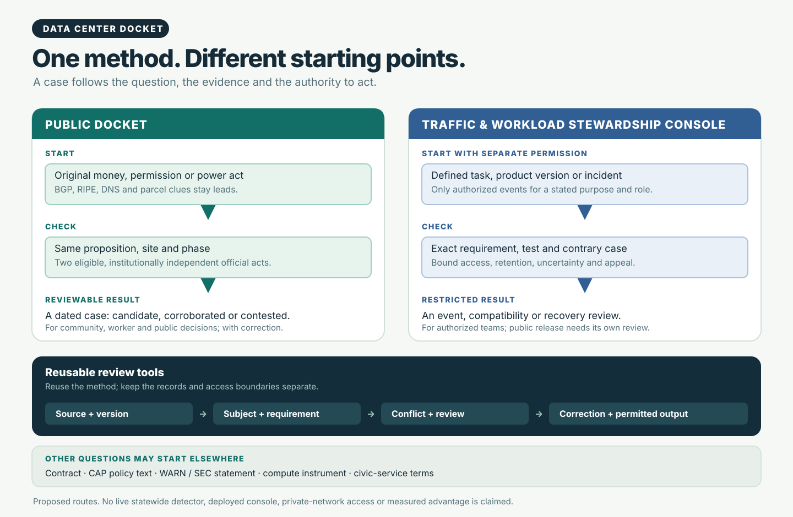
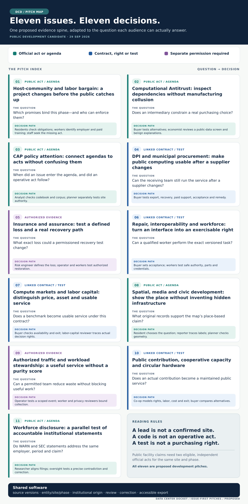

# Data Center Docket: eleven questions, several starting points

**Daniel Buk · 29 September 2026 · public development proposals**  
[Interactive audience atlas](https://dannybuk-byte.github.io/DCIM/) · [Audience guide](./README.md) · [Visual comparison](./comparison.md) · [Public signal atlas](./public-signal-atlas.md)

An incentive agreement, environmental notice and power filing may describe one project under different names. That is one way into Data Center Docket. A repair question can instead start with a product version and access term; a public-service question with a contract; a workload question with separately authorized task events. The tools could reuse source versions, exact claims, review and correction. The evidence and permission do not travel with them. This remains my personal research and software project; worker-centered work informs it, but no organization or prospective partner has authorized me to speak for it here.

## Start with the buildout record

The first development task is an open-source workflow for finding and reviewing **public, non-proprietary buildout signals**. It would retain the original document, date, version, source rights, site and phase; track changes; separate a new agency act from a copy of the old one; and show what is still missing. The source families are **money** (IDA/PILOT), **permission** (DEC ENB/SEQR and municipal boards), **power** (PSC/DPS and appropriate NYISO/utility records), retired-plant context, permits and imagery. Public entity, parcel and network metadata help find and check leads.

BGP/RIPE RIS and other routing data, DNS, certificate transparency, RDAP/ASN and peering records can sharpen a question. They cannot identify a tenant, read a private workload or packet, locate a cable, or confirm a facility. A public facility claim needs **two eligible, institutionally independent official acts** for the same proposition, site and phase. Admission of a source, eligibility of a claim and authorization to publish are separate decisions. A case can remain a candidate, disputed or withheld.

The public facility case keeps **original source, version, dates, precise claim, entity, site, phase, institutional origin, contrary evidence, status and correction**. A policy code, contract, product test or financial instrument needs its own documented link and evidence rule. The proposed Public Docket and separately permissioned Traffic and Workload Stewardship Console are coequal intended products; public records do not grant access to operational telemetry. The source families have been researched, but this page does not claim a live statewide detector, complete adapters or measured early-warning lead time.

**First build request:** Take one permitted public source, one disputed site match and one changed phase. Build a source adapter, an origin-aware review queue and a case export that another person can reconstruct. Compare it with manual research and an existing tracker: missed acts, false joins, time to reviewed answer and correction effort. Agree on rights, reviewers, paid participation where needed and a maintainer before a pilot.

## Choose the evidence for the question

| Start with | What must be checked | Possible decisions |
|---|---|---|
| A public project act | Same proposition, site and phase; two eligible independent institutional acts for a facility confirmation | Community bargain, hearing, jobs or power question |
| A contract, policy item, disclosure or market instrument | Exact clause or statement, parties, version, scope and a relevant contrary explanation | Procurement, CAP, competition, WARN–SEC or compute-market review |
| A product test, incident or task event | Separate authority, exact version and requirement, protected records, a comparator and a way to challenge the result | Repair, recovery, assurance or useful-workload decision |

The diagram shows these separate doors. A public site case can inform another inquiry when a documented link exists; it cannot supply a private test, a legal conclusion or a market price by proximity alone.

## Eleven issue pitches

Each pitch starts from a decision someone actually owns. The bridge shows where another constituency can contribute without borrowing that decision or its authority.

### 1. Host-community and labor bargain: a project changes before the public catches up

An incentive, a SEQR action and a power filing may concern different phases of one project. Residents need to know which burden or promised benefit applies to them. Workers need to know who owes a paid training or jobs commitment. Oversight staff need to know which instrument was executed and which record to request next. Docket could place those acts on one phase-aware timeline, with independent-origin review and a way to correct a bad match.

**Build together:** Test one public case with community and worker reviewers, a municipal researcher and a civic builder. Produce a source card, amendment history and obligation ledger. Include a mirrored agency record and a false site join as adverse cases. Requested megawatts are neither energized capacity nor forecast jobs.

**Bridge:** The resident chooses the promise; the worker identifies the employer and task; oversight asks for the missing act. Each retains a different question and remedy.

### 2. Computational Antitrust: inspect dependencies without manufacturing collusion

A public tender may appear competitive while its awards and later amendments depend on one pricing, assessment, cloud or access intermediary. That is a question to investigate, not a finding of collusion. Docket could make public contract versions and documented information flows inspectable. A buyer can test alternatives; a competition researcher can test common costs, capacity, quality and lawful standardization; repair and standards teams can test whether an interface works but admission remains controlled.

**Build together:** Make a reproducible public tender-to-award graph and a blinded review notebook with a declared question, negative cases, missing data and corrections. Keep sensitive rival bids out of a common public pool. Qualified counsel or economists would decide any legal use. Similar prices or shared vendors prove neither misconduct nor liability.

**Bridge:** Buyer defines the substitution problem → competition reviewer tests explanations → repair team tests the gate → independent assessor checks information separation → buyer considers an enforceable term.

### 3. CAP policy attention: connect agendas to acts without confusing them

The Comparative Agendas Project (CAP) may help show when data centers, AI, energy, labor and procurement received public attention. A coded agenda item is not a permit, and attention alone does not cause a buildout decision. Docket could put a versioned CAP classification beside the original bill, hearing or policy text, then keep any claimed link to a particular site on its own evidence track.

**Build together:** With a CAP researcher and policy analyst, test a codebook-aware crosswalk, map/timeline view, uncertain mappings and a negative case. The retained research did **not** obtain a complete CAP CSV corpus or verify a row-level AI/data-center subset; separately found proceedings were not verified CAP-coded rows. Check corpus rights and actual rows before presenting a live overlay.

**Bridge:** Scholar checks the classification; staff ask the policy question; local reviewers check the operative site act. The display keeps attention, authority and project status apart.

### 4. DPI and municipal procurement: make public computing usable after a supplier changes

Digital Public Infrastructure (DPI) has to survive a supplier change. For one municipal service, follow the public requirement from planning and tender through award, amendment and implementation. Can a qualified receiving team diagnose, update, export, recover and transfer the exact service? A library or resident group tests accessibility; workers and training sponsors test paid support skills; the buyer decides acceptance and remedy. Link a physical data-center project only if an actual contract or public instrument does.

**Build together:** Choose one procurement. Turn its clauses into a receiving-side task, exception register and reviewable export. Compare integrated supplier support with a qualified alternative. Name the maintenance payer, the party able to exercise exit and the remedy if the test fails.

**Bridge:** Public user names the service failure → buyer writes the requirement → technical and worker reviewers try it → oversight checks delivery.

### 5. Insurance and assurance: test a defined loss and a real recovery path

A resilience promise means little if a qualified worker lacks the credential, part, access, staffing or time to restore service. With an operator's separate permission, a fault drill could time detection, authorization, diagnosis, repair and restoration. A risk engineer defines the loss, trigger, beneficiary, limits and exclusions. Workers test safe paid authority; buyers test continuity. A public commitment can be reviewed in Public Docket, but a private incident requires its own authority.

**Build together:** Make a minimal incident-stage fixture in a controlled environment and a public-safe record of requirement, evidence, assessor and exception. Test parallel delays and harm moved to customers or workers; compare integrated support. A faster repair step is not proof of lower insured loss, coverage, premium or certification.

**Bridge:** Worker defines the task → authorized team tests the function → operator observes recovery → qualified risk reviewer analyzes the defined loss → buyer or insurer decides under the actual instrument.

### 6. Repair, interoperability and workforce: turn an interface into an exercisable right

A management interface can pass a profile while the technician still lacks a credential, firmware, part, service right or paid training. Docket could connect the exact product, version and profile to a lawful task and access term. Repair advocates ask what is blocked; technical workstreams test the function; workers define safe paid authority; buyers can require an actual receiving-side result.

**Build together:** Have an independent qualified team try one permitted task. Keep the requirement, observed result, rights and exceptions together, and test a contrary case where integrated support works better. Qualified reviewers handle legal applicability and security exceptions. A badge or open membership does not prove repairability.

**Bridge:** Repairer names the barrier → technical team tests a versioned function → workers set task authority → buyer sets acceptance and remedy.

### 7. Compute markets and labor capital: distinguish price, asset and usable service

A GPU-hour benchmark, reservation, financed facility and delivered service are four different things. Docket could follow a licensed benchmark version into an adopting contract and ask what capacity, fallback and service the contract actually provides. A buyer checks availability and exit; a lender tests a recovery assumption; a labor-capital reviewer traces any real decision right through fund and manager; workers test the maintenance premise. A hedge cannot repair a machine or deliver compute.

**Build together:** Test one contract dependency, fallback and service-failure scenario with explicit data rights and an adverse integrated-service comparison. Financial exposure alone establishes no pension control, public equity or insurance saving.

**Bridge:** Benchmark specialist identifies the reference → buyer checks adoption and service → labor-capital reviewer finds the actual authority → risk and competition reviewers ask their separate downside questions.

### 8. Spatial, media and civic development: show the place without inventing hidden infrastructure

A map can place a proposed phase beside hearings, power actions, existing buildings and promised jobs. It can also mislead. A resident chooses the local question; a planner supplies authoritative geometry; reporters trace each material label to an original act; workers and educators check whether a training route exists. A realistic rendering or nearby line does not prove a cable, packet path or partnership.

**Build together:** Make an accessible 2D map and timeline with source cards, phase/status controls, a disputed case and a text/table view. Ask a second reviewer to find the original and contrary records. Consider 3D or AR only with source-backed geometry and separate device and accessibility review.

**Bridge:** Resident chooses the question → planner supplies place and status → reporter checks records → worker or educator checks the opportunity → user can challenge the rendering.

### 9. Authorized traffic and workload stewardship: a useful service without a purity score

Public BGP, DNS and related OSINT cannot expose an operator's task graph, private traffic or exact energy use. A separately authorized service team could instead examine a cancellation, retry, cache miss, version change or recovery event with affected users. The question is whether a control improved useful work without blocking legitimate exploration, creativity, accessibility or redundancy. Individual worker productivity is outside this test.

**Build together:** Use synthetic or permitted task/artifact/version events with minimal collection, a false-block appeal and a quality/resource comparator. Keep restricted logs out of Public Docket. A blanket “slop” score would hide the very judgments this test needs to expose.

**Bridge:** User defines a useful result → service team defines an observable event → privacy and worker reviewers bound collection → evaluator tests error → operator decides a reversible control.

### 10. Public contribution, cooperative capacity and circular hardware

A subsidy, retired server, library service and cooperative maintenance pool have different owners and costs. Public investment does not automatically create public title or free compute. Docket could trace a real contribution through an executed use, beneficiary, maintainer, worker skill, cost and exit. A community asks whether a service is usable; educators ask who teaches it; workers ask who is paid to repair it.

**Build together:** Model one contribution-to-service case, including equipment condition, access, labor, disposal, maintenance and alternatives. Compare ordinary procurement or self-provision. Test whether a proposed commons would recreate a gatekeeper or shift unsafe work onto volunteers.

**Bridge:** Community institution names the service → cooperative defines governance and maintenance → workers and repairers test capability → buyer or funder compares full cost and exit.

### 11. Workforce disclosure: a parallel test of accountable institutional statements

The wider project also asks how a company's account of AI and work compares across WARN notices, SEC filings and earnings statements. That is a separate claim from facility detection. A company-wide AI narrative does not explain any one layoff; a buildout signal does not prove a hiring result. A source-linked contradiction queue could help workers, labor researchers, reporters and oversight staff frame a precise follow-up while protecting testimony.

**Build together:** Take one employer, period and exact disclosure claim. Align original filings, test alternative explanations and require human review. Reuse source tracking and correction tools where useful, while keeping this claim's evidence rule separate from the two-act facility test.

**Bridge:** Workers define the question → researchers align filings → journalist or oversight reviewer checks the discrepancy → employer can respond and correct the record.

## One software base, distinct authority

| Reusable piece | Evidence it takes | Who might use it | Test that could defeat the claim |
|---|---|---|---|
| Public adapter and change queue | Permitted official acts; separate support-only leads | Civic builders, residents, workers, staff, reporters | Missed notice, changed URL or one act mirrored twice |
| Site, phase, entity and origin record | Exact project and institutional links | Competition, oversight, utility and policy researchers | Wrong parcel or phase; one origin counted twice |
| Policy, procurement and rights ledger | Licensed CAP material where available; actual bill, contract and obligation | Municipal buyer, DPI practitioner, workers, community | Agenda code treated as binding policy; exported file that cannot be used |
| Technical and worker capability test | Authorized product, version, task, role and access term | Repairer, standards team, union, buyer | Profile passes but credential or paid authority is missing |
| Scoped recovery review | Separately consented fault and contract evidence | Operator, worker, risk engineer, purchaser | Faster task changes no defined loss; a parallel delay is hidden |
| Accessible map and case explanation | Licensed geometry and source-linked claims | Resident, reporter, planner, educator | Proximity implies a partnership; realism is mistaken for proof |

A sponsor could fund a source adapter, user test, review method or maintained component. Count shared work once, price recipient-specific work separately, and allow an unfavorable result. One participant cannot endorse or govern another's decision merely by joining the same case.

## Original source doors

Start a scoped case at [NY DEC ENB](https://dec.ny.gov/news/environmental-notice-bulletin) and [SEQR](https://dec.ny.gov/regulatory/permits-licenses/seqr), [NY DPS document search](https://documents.dps.ny.gov/search/Home/DocumentSearch), or the [NYISO interconnection process](https://www.nyiso.com/interconnections). Other issue sources include the [CAP master codebook](https://www.comparativeagendas.net/pages/master-codebook) and [datasets](https://www.comparativeagendas.net/datasets_codebooks), the [Open Contracting Data Standard](https://standard.open-contracting.org/latest/en/primer/how/), the [DOJ Procurement Collusion Strike Force](https://www.justice.gov/atr/procurement-collusion-strike-force), and [FM loss-prevention sheets](https://www.fm.com/resources/fm-data-sheets). Check current coverage, rights, schema and fitness for the exact case. These links establish neither a detected facility nor a partner.
