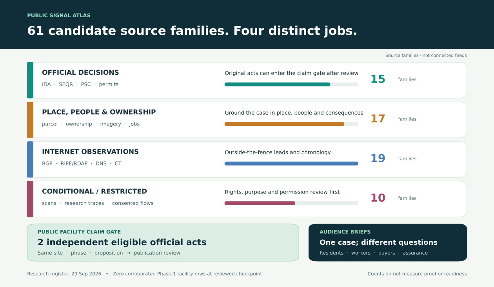

# Public signal atlas

An IDA considers a tax break. A utility files a power request. A local board reviews a site plan. If those records concern the **same place and phase**, what is the public being asked to approve—and what comes back to workers and neighbors?

This atlas maps **61 candidate source families**. Fifteen concern official records, seventeen help resolve place, people and ownership, nineteen are Internet observations, and ten have conditional or restricted access. It is a research guide, not 61 feeds connected to the app.

**How the pieces fit:** find the applicant and parcel, then put original decisions, amendments and corrections on a timeline. Read the power request beside the jobs and tax terms. BGP, RIPE RIS, DNS and registration changes can point to a record worth seeking; they do not establish a building. The resulting brief should let a reader open each act, see any conflict and know the next question to ask.

**What would confirm a facility claim:** the strict public floor requires two eligible official acts from institutionally independent sources about the same site, phase and proposition. An agency notice that repeats another agency's act shares its origin. An aggregator, company statement or network observation cannot supply a second official act. Source admission, claim review and publication are separate decisions.

**Where the build stands (29 September 2026):** the reviewed state had **zero corroborated Phase-1 facility rows** and no live path from official records to the public interface. Historical BGP RIS and certificate queries were support-only. A link below points to a candidate source and its documentation, not an integrated feed, permission to commercialize its data or proof of a named site. Operator flows, packet inspection and service logs would need a separately authorized workspace.

## Choose a lens

| Lens | Families | What it can answer | Claim role |
|:--|--:|:--|:--|
| [Official records](#official-decisions) | 15 | What was requested, decided or amended? | Eligible independent acts may confirm after review |
| [Place, people & ownership](#place-people--ownership) | 17 | Which site, entity and community are involved? | Context and identity; insufficient alone |
| [Internet observations](#internet-observations) | 19 | Did a public network footprint change? | Leads and timing; no facility confirmation |
| [Conditional / restricted](#conditional--restricted) | 10 | What could a licensed or consented source add? | Rights and permission review; no public facility floor |

The bars in the graphic count entries in this guide. They do not measure evidence strength, geographic coverage or product readiness. Publicly visible data may still have limits on reuse. Open-source software does not make the data it reads open.

## One case, different next questions

| Reader | First question | Useful handoff |
|:--|:--|:--|
| Residents | What is proposed here, and when can we weigh in? | Original site plan, decisions so far, unresolved questions and next public date |
| Municipal buyers / DPI | What does the city get, and can it change vendors? | Signed terms, amendments and the clause governing repair, data access or exit |
| Workers / training groups | Which jobs were promised, at what wage, and who can enforce that? | Jobs pledge beside signed terms and later compliance reports |
| Insurance / assurance | Which failure has a documented control, and what still needs testing? | Permit condition beside the authorized test or continuity record to request |
| Competition / CAP researchers | Who gets access, and when did public bodies take up the issue? | Original subsidy, grid and procurement terms beside coded agenda items |

These are proposed briefs for different readers, not validated automated products or findings about a named facility. The [interactive atlas](https://dannybuk-byte.github.io/DCIM/public-signal-atlas.html) lets you search and filter the families and try a fictional evidence example.

## Full source register

Start with the decision someone faces, then find its original record. Each entry shows what the source can answer, what other record to seek, where the inference stops and which access terms to check.

### Official decisions

Keep the board vote, order or permit tied to the exact project. A statewide table may repeat a local act; a second appearance is still one decision.

- **[IDA agendas, resolutions & PILOT agreements](https://www.ny.gov/agencies/industrial-development-agencies)** · Local IDA. A project asks for or receives public financial assistance. **Join:** Tie named project, entity, site, dated jobs and tax terms to later environmental and power acts. **Limit:** An application is not an executed benefit or a built site. **Access:** Public local records; terms vary.
- **[IDA project data / PARIS](https://data.ny.gov/Government-Finance/Industrial-Development-Agencies-Project-Data/sady-n996)** · NY Authorities Budget Office / OSC. Annual IDA-reported projects and assistance. **Join:** Compare local packets with later statewide reporting and revisions. **Limit:** A report of the same IDA act is an echo, not independent corroboration. **Access:** Public dataset; check license and lag.
- **[Economic incentive database](https://esd.ny.gov/database-economic-incentives-frequently-asked-questions)** · Empire State Development. State program incentive records. **Join:** Compare assistance across instruments and recipients. **Limit:** Covers its programs, not every local tax deal. **Access:** Public; program and reuse terms vary.
- **[Environmental Notice Bulletin](https://dec.ny.gov/news/environmental-notice-bulletin)** · NYS DEC ENB. Weekly notices of environmental actions and hearings. **Join:** Spot a proposed project and align its dates and scope with local decisions. **Limit:** An ENB mirror of a municipal lead-agency act shares that origin. **Access:** Public notices; capture exact original.
- **[SEQR forms, EAF and EIS](https://dec.ny.gov/regulatory/permits-licenses/seqr)** · DEC and lead agencies. Environmental review, alternatives and determinations. **Join:** Compare proposed footprint and impacts across versions and phases. **Limit:** Review stage is not final permit or constructed capacity. **Access:** Public where posted; local coverage varies.
- **[Planning and zoning agendas](https://webapi.legistar.com/)** · Municipal boards / Legistar where used. Hearings, site plans, votes and attachments. **Join:** Link local land-use choices to state filings and community questions. **Limit:** One vendor platform is not a universal municipal feed. **Access:** Local public records; platform terms vary.
- **[DART permit application rows](https://data.ny.gov/)** · NYS DEC DART. Agency application and permit records. **Join:** Preserve raw row, application and facility identity and changes. **Limit:** Many rows or DEC echoes can still be one origin. **Access:** Dataset-specific admission required.
- **[Air, water and SPDES permits](https://dec.ny.gov/maps/interactive-maps/decinfo-locator/layers)** · NYS DEC DECinfo. Applications, issued conditions and regulated activities. **Join:** Check exact permit scope against site, cooling or backup-power questions. **Limit:** A listed permit does not establish every aspect of a campus. **Access:** Public layers; source-specific limits.
- **[DMM cases and filings](https://documents.dps.ny.gov/search/Home/DocumentSearch)** · NYS DPS / PSC. Utility petitions, orders, tariffs and attachments. **Join:** Relate a power proposal or condition to the right project and phase. **Limit:** A filing is not approval, service, energized load or independent of its author. **Access:** Public docket; some attachments restricted.
- **[Interconnection and large-load material](https://www.nyiso.com/interconnections)** · NYISO. Public studies, queues and planning material where available. **Join:** Trace relevant study milestones and grid context beside other acts. **Limit:** Generator queues are not a complete named data-center load registry. **Access:** Public subset; exact case availability varies.
- **[Hydropower and allocation actions](https://services.nypa.gov/Services/Incentives/Economic-Development-Funding-Programs)** · NYPA board / programs. Power allocations and economic-development conditions. **Join:** Check a documented allocation against project jobs and investments. **Limit:** Allocation is not proof of facility operation. **Access:** Public materials; exact decisions needed.
- **[Border-region service requests](https://www.pjm.com/planning/service-requests)** · PJM. Public interconnection/service-request stages. **Join:** Add cross-border grid context when a documented project link exists. **Limit:** A generation request is not necessarily a data-center load. **Access:** Public scope and queue type matter.
- **[Generator retirement reports](https://www.eia.gov/electricity/data/eia860m/)** · EIA-860M / EIA-860. Preliminary monthly and annual plant status. **Join:** Find plausible retired-plant redevelopment context and compare dates. **Limit:** Retirement does not imply a data center; 860M/860 share reporting lineage. **Access:** Public downloads; annual/monthly vintages differ.
- **[Building permits and inspections](https://opendata.cityofnewyork.us/)** · Local building departments. Issued work scope and stage where jurisdiction publishes it. **Join:** Check whether work follows a proposal at an exact address/phase. **Limit:** Jurisdictions differ; a permit is not observed completion. **Access:** Local public coverage and licensing vary.
- **[Federal power filings](https://www.ferc.gov/ferc-online/elibrary)** · FERC eLibrary. Public federal proceedings and agreements. **Join:** Add an exact federal instrument where relevant to a project. **Limit:** Protected CEII and nonpublic material are excluded. **Access:** Public subset; filing scope matters.

### Place, people & ownership

Use these layers to locate a site, sort out company names and ask who may be affected. A parcel overlap or a copied registry row is a lead to check, not an agency approval.

- **[Corporate registrations](https://apps.dos.ny.gov/publicInquiry/)** · NY Department of State. Published entity status, names and filings. **Join:** Disambiguate applicant, affiliate and project-company names. **Limit:** Registered address is not beneficial owner or physical site. **Access:** Public search; minimize personal data.
- **[Parcel boundaries and assessed property](https://data.gis.ny.gov/)** · County GIS / NY GIS. Parcel geometries, addresses and land context. **Join:** Resolve a candidate site and distinguish adjacent phases. **Limit:** A parcel overlap is not project ownership or approval. **Access:** Coverage, precision and reuse vary by county.
- **[Orthophotos and state maps](https://gis.ny.gov/shareGIS/)** · NY GIS Clearinghouse. Dated imagery and spatial layers. **Join:** Compare documented site footprint with dated visual context. **Limit:** Image interpretation is not an official facility act. **Access:** License, acquisition date and resolution vary.
- **[Landsat and Sentinel imagery](https://www.usgs.gov/landsat-missions/landsat-data-access)** · USGS / Copernicus. Repeated earth observation imagery. **Join:** Look for large-scale physical change after a known site is identified. **Limit:** Cloud cover, resolution and timing limit construction claims. **Access:** Open imagery with product terms; not real time.
- **[Issuer filings](https://www.sec.gov/search-filings)** · SEC EDGAR. Company disclosures, capex and material contracts where filed. **Join:** Connect an issuer claim to an entity and dated public instrument. **Limit:** A company statement is not an agency act or site proof. **Access:** Public; automated access policy applies.
- **[WARN notices](https://dol.ny.gov/warn-dashboard)** · NY Department of Labor. Employer workforce notices. **Join:** Compare workforce disclosure and employer identity with a separate case. **Limit:** Silence is not proof of AI cause or promised jobs. **Access:** Public; protect worker privacy.
- **[Community baseline](https://www.census.gov/data/developers/data-sets/acs-5year.html)** · Census ACS API. Area estimates on people, housing and commuting. **Join:** Give residents a place-specific baseline for questions. **Limit:** Area estimates are not project-specific causal outcomes. **Access:** Public API; margins of error matter.
- **[Jobs and wages baseline](https://www.bls.gov/cew/)** · BLS QCEW. County/industry employment and wage series. **Join:** Compare proposed training/jobs with actual regional labor structure. **Limit:** Industry aggregate cannot identify a site's workers. **Access:** Public; suppression and lag apply.
- **[Disadvantaged community tracts](https://climate.ny.gov/Resources/Disadvantaged-Communities-Criteria)** · NYSERDA / NY Climate Act. Designated geography and criteria. **Join:** Place a proposal alongside formally defined community context. **Limit:** Designation alone does not measure this project's impact. **Access:** Public boundary/version review.
- **[Environmental compliance context](https://echo.epa.gov/tools/data-downloads)** · EPA ECHO. Facility permits and compliance records. **Join:** Check a documented regulated site and federal/state context. **Limit:** State-origin records mirrored by EPA do not create a new act. **Access:** Public; facility matching and lag matter.
- **[Public procurement releases](https://standard.open-contracting.org/latest/en/primer/how/)** · Agency portals / OCDS where published. Planning, tender, award, contract and implementation stages. **Join:** Compare promised service and later amendments across buyers. **Limit:** OCDS is a schema; each actual agency record needs its source. **Access:** Public only where published; terms vary.
- **[Comparative Agendas Project (CAP) codes](https://www.comparativeagendas.net/datasets_codebooks)** · Comparative Agendas Project. Coded topics and jurisdictional policy items. **Join:** Overlay attention and debate beside separately verified site acts. **Limit:** A CAP code is not an operative permit; full target corpus not retrieved. **Access:** Dataset/codebook/version rights to verify.
- **[Legal entity identifiers](https://search.gleif.org/)** · GLEIF LEI search. Published LEIs and parent relationship records. **Join:** Cross-check public corporate identity across filings. **Limit:** Reported relationship is not a facility or operational control. **Access:** Public data; field/date limits.
- **[Subsidy aggregator](https://subsidytracker.goodjobsfirst.org/)** · Good Jobs First Subsidy Tracker. Indexed subsidy deals assembled from government reporting. **Join:** Discover a named deal and retrieve its underlying IDA/agency act. **Limit:** Aggregator is not an independent agency origin and may lag. **Access:** Third-party terms; discovery candidate.
- **[Federal award identity](https://www.usaspending.gov/)** · SAM.gov / USAspending. Federal awards and recipient names. **Join:** Follow a documented federal contract or recipient relationship. **Limit:** An award is not a site buildout without a project link. **Access:** Public data; use program-specific records.
- **[Facility discovery lists](https://interconnection.fyi/)** · Interconnection.fyi / datacenter.fyi. Third-party listed interconnection or data-center candidates. **Join:** Generate a lead, then seek exact official project records. **Limit:** Listing is not a permit, independent act or verified site phase. **Access:** Third-party terms and attribution; research candidate.
- **[Community-sourced facility maps](https://www.fractracker.org/)** · FracTracker / other local maps. Mapped project and community observations. **Join:** Find local issues, names and records worth checking. **Limit:** Map points can derive from the same upstream public act. **Access:** Third-party terms; research candidate.

### Internet observations

A route changes; a domain appears; a registry lists a new holder. BGP, RIPE RIS, DNS, RDAP and public measurements can help decide which original record to seek next. Their vantage and date matter. None locates a building or tenant, exposes packet contents or maps a physical cable path.

- **[BGP announcements and withdrawals](https://ris-live.ripe.net/manual/)** · RIPE RIS / RIS Live. Observed prefix, origin ASN and AS path at participating collectors. **Join:** Sequence network-footprint change against public project acts. **Limit:** No traffic volume, tenant, server address or building proof. **Access:** Public observations; commercial permission may be required.
- **[BGP archive and API](https://api.routeviews.org/docs/)** · RouteViews. Collector RIBs and updates across vantage points. **Join:** Cross-check first/last observations and coverage. **Limit:** More collectors are measurement coverage, not agency independence. **Access:** Public API; rate limits/terms.
- **[Routing summaries](https://stat.ripe.net/docs/)** · RIPEstat. Derived routing, resource and country summaries. **Join:** Triangulate change, then retrieve underlying RIS/registry lineage. **Limit:** Derivative view is not a separate original source. **Access:** Public API; commercial derivative terms.
- **[IP and ASN registrations](https://www.arin.net/resources/registry/whois/rdap/)** · ARIN / RIR RDAP. Published resource holder, prefix and registration changes. **Join:** Disambiguate public network resource and organization. **Limit:** Registration address is not equipment location or tenancy. **Access:** Public lookup; ARIN commercial-product restriction.
- **[Delegated number-resource files](https://www.nro.net/about/rirs/statistics/)** · RIR delegated statistics. Allocation and delegation time series. **Join:** Compare resource changes and registry metadata by vintage. **Limit:** Allocated does not mean routed or deployed at a site. **Access:** Public files; RIR terms differ.
- **[Declared route objects](https://www.radb.net/support/informational/query.html)** · IRR / RADB. Maintainer-declared routes and origin policy. **Join:** Compare intended registration with observed BGP and ROA. **Limit:** Can be stale or self-asserted; not a live route. **Access:** Public query; bulk/API may require subscription.
- **[Route-origin authorization](https://www.ripe.net/manage-ips-and-asns/resource-management/rpki/bgp-origin-validation/)** · RPKI ROAs / Routinator. Valid/Invalid/NotFound prefix-origin state. **Join:** Separate route authorization change from observed BGP change. **Limit:** Valid does not prove company legitimacy or location. **Access:** Public repositories; software and data terms.
- **[Peering and facility assertions](https://docs.peeringdb.com/howto/search/)** · PeeringDB. Voluntary network, exchange and facility listings. **Join:** Form a candidate interconnection relationship to check. **Limit:** Self-maintained entry does not prove traffic, tenancy or equipment. **Access:** Basic search public; commercial reuse restricted.
- **[Exchange member exports](https://www.ix-f.net/ixp-database/)** · IX-F / IXP-operated lists. Published exchange participation assertions. **Join:** Check PeeringDB claims against direct IXP publication and time. **Limit:** PeeringDB may import the same IX-F export; origin can be shared. **Access:** Public where provided; license varies.
- **[DNS and reverse DNS](https://www.icann.org/resources/pages/dns-2023-05-30-en)** · Authoritative public DNS / PTR. A/AAAA/CNAME/NS/PTR names and addresses at query time. **Join:** Find naming changes and candidate entity or region hints. **Limit:** CDN, cloud, shared hosting and stale names prevent site proof. **Access:** Public query; bulk passive history often licensed.
- **[Certificate transparency](https://certificate.transparency.dev/howctworks/)** · CT logs. Certificate/domain issuance observations. **Join:** Discover service naming and version chronology for review. **Limit:** Certificate does not prove service deployment or ownership. **Access:** Public logs; log/operator terms and privacy review.
- **[Self-published geofeeds](https://datatracker.ietf.org/doc/html/rfc8805)** · RFC 8805 publisher feeds. Operator-chosen prefix location at chosen precision. **Join:** Check an operator's own location claim against other sources. **Limit:** City/region hint is not a building coordinate or independent act. **Access:** Public where published; verify publisher authority.
- **[Active public measurements](https://atlas.ripe.net/docs/)** · RIPE Atlas. Probe ping, traceroute, DNS and TLS results at vantage/time. **Join:** Check reachability and path change around an externally defined event. **Limit:** Traceroute is not physical cable or a user's packet path. **Access:** Public results; new tests use credits; commercial permission.
- **[Public looking-glass views](https://www.peeringdb.com/)** · Operator looking glasses. Selected route or reachability from disclosed vantage. **Join:** Corroborate an observed routing question from another vantage. **Limit:** Visibility is partial and terms/provider vary. **Access:** Per-provider public access/terms.
- **[Inferred Internet topology](https://www.caida.org/catalog/datasets/overview/)** · CAIDA Ark / topology datasets. Traceroute-based IP/AS-level inferred relationships. **Join:** Explore alternative network explanations and compare with BGP. **Limit:** Not physical cable path or site location. **Access:** Some public, some request-access.
- **[Censorship tests](https://api.ooni.org/)** · OONI Explorer / API. Volunteer-run tests and possible interference. **Join:** Study whether access conditions differ by region/time. **Limit:** Not facility construction or data-center traffic. **Access:** Open measurements; privacy/coverage limits.
- **[Performance tests](https://www.measurementlab.net/data/)** · Measurement Lab NDT. Participant-initiated network performance. **Join:** Put service experience in regional context. **Limit:** Tester IP/time and selection bias; not target facility throughput. **Access:** Published data CC0; privacy aggregation needed.
- **[Aggregated edge trends](https://developers.cloudflare.com/radar/investigate/netflows/)** · Cloudflare Radar NetFlows. Normalized trends from one edge network. **Join:** Add broad Internet context to a public question. **Limit:** Underlying measurements proprietary, no site packet attribution. **Access:** Public display/API terms; not open raw telemetry.
- **[Publisher cloud IP ranges](https://docs.aws.amazon.com/vpc/latest/userguide/aws-ip-ranges.html)** · AWS / Microsoft public range files. Provider-published prefix ranges and updates. **Join:** Avoid mistaking generic cloud ranges for a named operator's site. **Limit:** A cloud prefix is shared and not a physical building proof. **Access:** Publisher terms; corroboration support only.

### Conditional / restricted

These ten families include paid, request-access and consented data. A later inquiry may use them with the right permission. This public guide does not claim access to operator flows, packets or service logs.

- **[Internet scan summaries](https://docs.censys.com/docs/data-access-tiers-entitlements)** · Censys / Shodan. Third-party public-service observations. **Join:** Suggest a bounded organization-level research question. **Limit:** Free tiers limited; scan result does not locate internal hardware. **Access:** Proprietary tiers and reuse terms; no app scanning presumed.
- **[Historical passive DNS / scans](https://opendata.rapid7.com/sonar.fdns_v2/)** · Rapid7 Sonar. Bulk DNS and scan snapshots. **Join:** Compare naming history where permission and license allow. **Limit:** Request access; scan data do not establish a facility. **Access:** Conditional access and redistribution.
- **[Anonymized packet headers](https://www.caida.org/catalog/datasets/passive_dataset/)** · CAIDA passive traces. Historical backbone packet header samples without payload. **Join:** Research parser and privacy methods at a declared vantage. **Limit:** Not live packets from a candidate data center. **Access:** Request / acceptable-use access.
- **[Backbone packet research traces](https://mawi.wide.ad.jp/mawi/)** · MAWI / WIDE. Scrubbed backbone trace samples. **Join:** Benchmark packet tools and error handling. **Limit:** Research vantage, not target facility; usage restrictions. **Access:** Research use and privacy conditions.
- **[Authorized flow and packet data](https://www.wireshark.org/faq.html)** · Operator or worker-authorized NetFlow/IPFIX, Zeek, PCAP. Actual metadata or packets only at a permitted vantage. **Join:** Test a specific service, repair or workload hypothesis in a separate workspace. **Limit:** No public OSINT access; no automatic facility confirmation. **Access:** Separate permission, minimization, retention and role controls.
- **[Authorized task and service events](https://opentelemetry.io/docs/)** · OpenTelemetry / job, cache and incident logs. Consented application traces and resource events. **Join:** Compare cancellations, retries, recovery stages and quality. **Limit:** Cannot infer purpose or worker value from packet counts. **Access:** Separate permissioned Stewardship Console.
- **[Commercial passive DNS](https://docs.securitytrails.com/)** · SecurityTrails and comparable vendors. Vended DNS history and enrichment. **Join:** Extend a narrowly scoped name-change question if licensed. **Limit:** No presumption of free access or facility proof. **Access:** Paid/limited tiers; rights review.
- **[Internet noise and reputation](https://docs.greynoise.io/)** · GreyNoise / Spamhaus. Vended or published abuse/noise classifications. **Join:** Reduce false interpretation of generic scans or incident context. **Limit:** Threat labels are not data-center construction signals. **Access:** Access and redistribution terms differ.
- **[URL and web observations](https://urlscan.io/docs/api/)** · urlscan.io. Submitted page and request metadata at scan time. **Join:** Discover a public web identity to verify from original sources. **Limit:** Submission bias and possible private content; no site proof. **Access:** Public/private visibility and API terms.
- **[Open corporate aggregation](https://api.opencorporates.com/)** · OpenCorporates. Aggregated registry entity relationships. **Join:** Find original state registry records behind a proposed affiliate link. **Limit:** Aggregator echoes registry and can mis-link a similarly named entity. **Access:** API and reuse licensing varies.

## Read the boundary correctly

A BGP update, DNS answer or traceroute cannot inspect packets inside a candidate facility. CAIDA and MAWI traces describe their own research vantage. NetFlow/IPFIX, Zeek, PCAP and application logs require an authorized collection point, limited data use, retention rules and separate governance. Public facility confirmation still rests on eligible, independent official acts.

